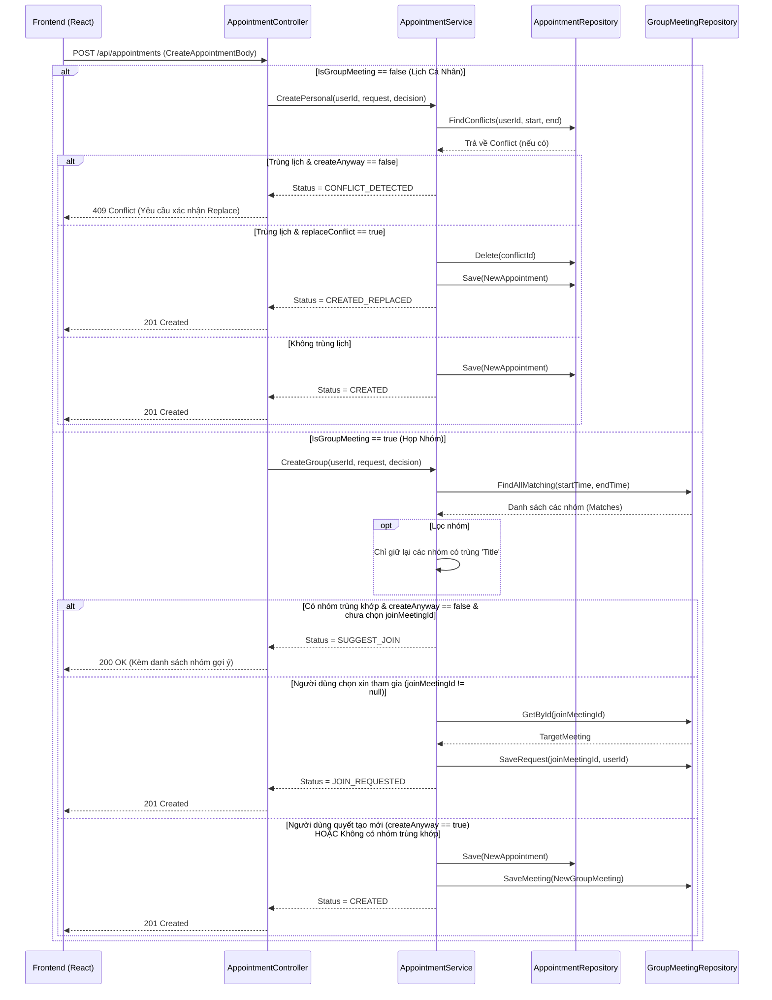

# 🔄 Workflow: Thêm mới Lịch hẹn (Add Appointment)

Tài liệu này mô tả chi tiết luồng nghiệp vụ (Sequence Flow) xảy ra bên dưới hệ thống mỗi khi một người dùng nhấn nút "Lưu" để thêm một lịch hẹn hoặc cuộc họp nhóm mới từ giao diện Web.

Luồng này thể hiện rõ sức mạnh của nguyên lý **Encapsulation (Đóng gói)** và **Separation of Concerns (Tách biệt Mối quan tâm)** trong kiến trúc N-Tier.

---

## 1. Biểu đồ Tuần tự (Sequence Diagram)

Dưới đây là sơ đồ Mermaid thể hiện cách mà Request đi qua các thành phần của hệ thống.

---

## 2. Diễn giải chi tiết từng bước

### Bước 1: Khởi nguồn từ Client (Frontend)
- Người dùng điền Form (Tên cuộc họp, Địa điểm, Giờ bắt đầu/Kết thúc, Checkbox "Là cuộc họp nhóm" và "Hình thức nhắc nhở").
- Khi nhấn Submit, React gọi API `POST /api/appointments` với cục dữ liệu JSON (DTO `CreateAppointmentBody`). Dữ liệu này có thể chứa thêm đối tượng `Decision` (quyết định của user: `createAnyway`, `replaceConflict`, `joinMeetingId`).

### Bước 2: Tầng Controller Tiếp nhận (`AppointmentController.cs`)
- Nhận Data, ép kiểu JSON thành class `CreateAppointmentBody`.
- Kiểm tra xem đây là lịch cá nhân hay lịch nhóm dựa vào cờ `isGroupMeeting`.
- Gọi hàm tương ứng của `AppointmentService`.

### Bước 3: Xử lý Nghiệp vụ tại Service (`AppointmentService.cs`)
Tầng này chịu trách nhiệm lớn nhất, bao gồm 2 rẽ nhánh chính:

#### Nhánh A: Lịch Cá Nhân (Personal Appointment)
1. Dùng `AppointmentRepository.FindConflicts()` để quét trong Database xem từ `start_time` đến `end_time` có lịch nào của User này đè lên không.
2. **Nếu BỊ TRÙNG**:
   - Nếu Client chưa gửi quyết định (`decision.createAnyway == false`): Service dừng ngay, trả về cờ báo `CONFLICT_DETECTED` cho Controller để Controller báo lỗi `409` về Frontend. Frontend lúc này sẽ văng ra 1 hộp thoại *"Bạn bị trùng lịch, có muốn thay thế không?"*.
   - Nếu Client đã gửi quyết định (`replaceConflict == true`): Service gọi `AppointmentRepository.Delete(id_cũ)` để xóa lịch cũ đi.
3. Sau khi "dọn dẹp" xong, Service khởi tạo Object `Appointment` (kèm theo Reminders), và ném cho `AppointmentRepository.Save()` để ghi vào MySQL.

#### Nhánh B: Cuộc họp Nhóm (Group Meeting)
1. Dùng `GroupMeetingRepository.FindAllMatching()` để lấy lên toàn bộ các cuộc họp diễn ra cùng khoảng thời gian đó.
2. Dùng code C# (LINQ) để lọc xem có nhóm nào trùng cả **Tên cuộc họp (Title)** hay không.
3. **Nếu PHÁT HIỆN NHÓM TƯƠNG TỰ**:
   - Nếu Client chưa quyết định (`createAnyway == false` và chưa có `joinMeetingId`): Service từ chối tạo mới, ném trả về danh sách các nhóm bị trùng cùng trạng thái `SUGGEST_JOIN`. Frontend sẽ hiển thị danh sách các nhóm đó cho User bấm "Tham gia".
4. **Xử lý lựa chọn của User**:
   - Nếu User bấm nút tham gia nhóm gợi ý: Gửi API lần 2 kèm theo `joinMeetingId`. Service chèn User vào bảng `pending_requests` của nhóm đó, trả về trạng thái `JOIN_REQUESTED`.
   - Nếu User khăng khăng tạo nhóm mới (`createAnyway == true`): Service gọi `AppointmentRepository.Save()` để lưu vào bảng `appointments`, lấy ra ID vừa tạo, sau đó gọi tiếp `GroupMeetingRepository.SaveMeeting()` để liên kết nó thành `group_meetings`.

### Bước 4: Trả kết quả về Frontend
Controller sẽ dựa vào `Result.Status` do Service trả lên để map ra HTTP Status Code (200, 201, 409...) và gửi dữ liệu về cho Frontend render ra màn hình.
