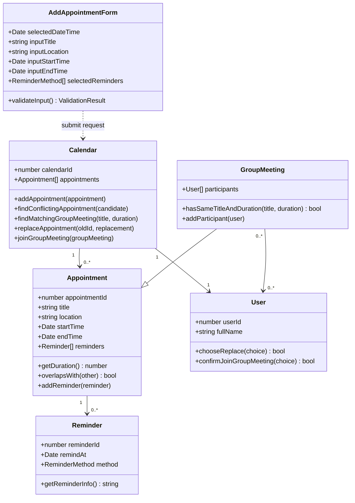
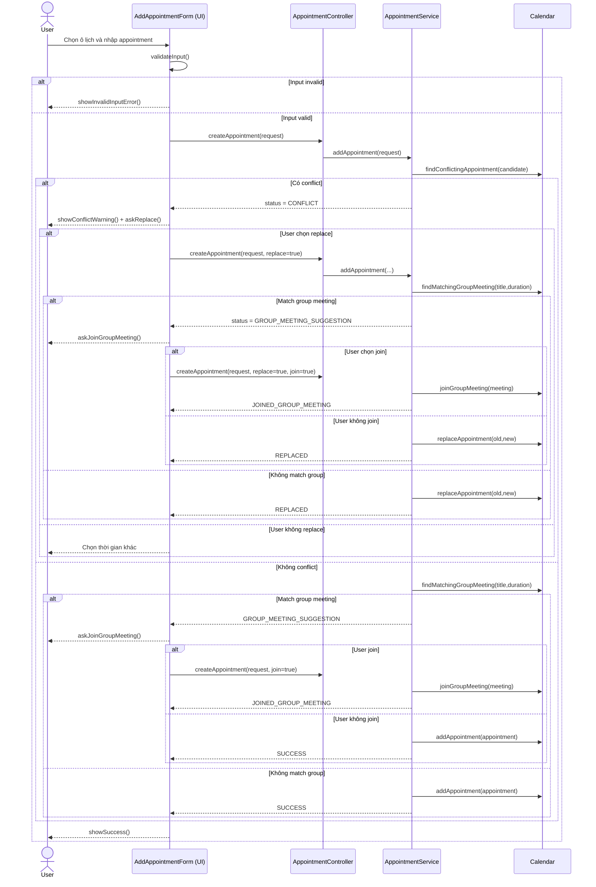

# OOAD Diagrams

## Class Diagram

```mermaid
classDiagram
    class AddAppointmentForm {
      +Date selectedDateTime
      +string inputTitle
      +string inputLocation
      +Date inputStartTime
      +Date inputEndTime
      +ReminderMethod[] selectedReminders
      +validateInput() ValidationResult
    }

    class Calendar {
      +number calendarId
      +Appointment[] appointments
      +addAppointment(appointment)
      +findConflictingAppointment(candidate)
      +findMatchingGroupMeeting(title, duration)
      +replaceAppointment(oldId, replacement)
      +joinGroupMeeting(groupMeeting)
    }

    class Appointment {
      +number appointmentId
      +string title
      +string location
      +Date startTime
      +Date endTime
      +Reminder[] reminders
      +getDuration() number
      +overlapsWith(other) bool
      +addReminder(reminder)
    }

    class GroupMeeting {
      +User[] participants
      +hasSameTitleAndDuration(title, duration) bool
      +addParticipant(user)
    }

    class Reminder {
      +number reminderId
      +Date remindAt
      +ReminderMethod method
      +getReminderInfo() string
    }

    class User {
      +number userId
      +string fullName
      +chooseReplace(choice) bool
      +confirmJoinGroupMeeting(choice) bool
    }

    GroupMeeting --|> Appointment
    Calendar "1" --> "0..*" Appointment
    Appointment "1" --> "0..*" Reminder
    Calendar "1" --> "1" User
    GroupMeeting "0..*" --> "0..*" User
    AddAppointmentForm ..> Calendar : submit request
```

## Sequence Diagram

```mermaid
sequenceDiagram
    actor User
    participant UI as AddAppointmentForm (UI)
    participant Controller as AppointmentController
    participant Service as AppointmentService
    participant Calendar as Calendar

    User->>UI: Chọn ô lịch và nhập appointment
    UI->>UI: validateInput()
    alt Input invalid
        UI-->>User: showInvalidInputError()
    else Input valid
        UI->>Controller: createAppointment(request)
        Controller->>Service: addAppointment(request)
        Service->>Calendar: findConflictingAppointment(candidate)

        alt Có conflict
            Service-->>UI: status = CONFLICT
            UI-->>User: showConflictWarning() + askReplace()
            alt User chọn replace
                UI->>Controller: createAppointment(request, replace=true)
                Controller->>Service: addAppointment(...)
                Service->>Calendar: findMatchingGroupMeeting(title,duration)
                alt Match group meeting
                    Service-->>UI: status = GROUP_MEETING_SUGGESTION
                    UI-->>User: askJoinGroupMeeting()
                    alt User chọn join
                        UI->>Controller: createAppointment(request, replace=true, join=true)
                        Service->>Calendar: joinGroupMeeting(meeting)
                        Service-->>UI: JOINED_GROUP_MEETING
                    else User không join
                        Service->>Calendar: replaceAppointment(old,new)
                        Service-->>UI: REPLACED
                    end
                else Không match group
                    Service->>Calendar: replaceAppointment(old,new)
                    Service-->>UI: REPLACED
                end
            else User không replace
                UI-->>User: Chọn thời gian khác
            end
        else Không conflict
            Service->>Calendar: findMatchingGroupMeeting(title,duration)
            alt Match group meeting
                Service-->>UI: GROUP_MEETING_SUGGESTION
                UI-->>User: askJoinGroupMeeting()
                alt User join
                    UI->>Controller: createAppointment(request, join=true)
                    Service->>Calendar: joinGroupMeeting(meeting)
                    Service-->>UI: JOINED_GROUP_MEETING
                else User không join
                    Service->>Calendar: addAppointment(appointment)
                    Service-->>UI: SUCCESS
                end
            else Không match group
                Service->>Calendar: addAppointment(appointment)
                Service-->>UI: SUCCESS
            end
        end

        UI-->>User: showSuccess()
    end
```
