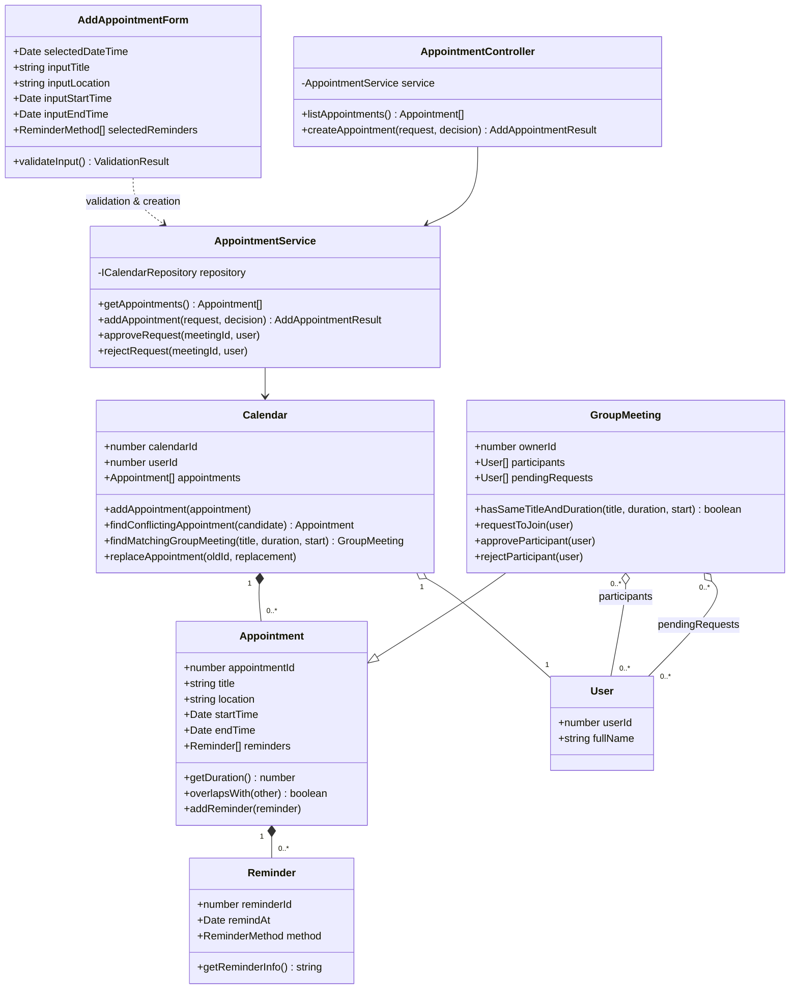

# OOAD Diagrams

## Class Diagram



## Sequence Diagram: Add Calendar Appointment

```mermaid
sequenceDiagram
    actor User
    participant UI as AddAppointmentFormModal
    participant Page as CalendarPage
    participant Controller as AppointmentController
    participant Service as AppointmentService
    participant Model as Calendar / Appointment

    User->>UI: Nhập thông tin (Title, Time, Reminders, ...)
    User->>UI: Click "Tạo lịch ngay"
    UI->>Page: onSubmit(request)
    Page->>Controller: createAppointment(request)
    Controller->>Service: addAppointment(request)
    
    Service->>Service: form.validateInput()
    alt Dữ liệu không hợp lệ (Trống tên, duration <= 0, ...)
        Service-->>Controller: status: 'INVALID'
        Controller-->>Page: status: 'INVALID'
        Page-->>User: Hiển thị Alert báo lỗi
    else Dữ liệu hợp lệ
        Service->>Service: findMatchingGroupMeeting(title, duration, start)
        alt Tìm thấy Group Meeting trùng khớp
            Service-->>Controller: status: 'GROUP_MEETING_SUGGESTION'
            Controller-->>Page: status: 'GROUP_MEETING_SUGGESTION'
            Page-->>User: window.confirm("Bạn có muốn xin tham gia họp nhóm?")
            alt User chọn JOIN
                Page->>Controller: createAppointment(request, joinGroupMeeting: true)
                Controller->>Service: addAppointment(..., joinGroupMeeting: true)
                Service->>Model: groupMeeting.requestToJoin(currentUser)
                Service-->>Page: status: 'JOINED_GROUP_MEETING'
                Page-->>User: Alert("Đã gửi yêu cầu tham gia")
            else User chọn KHÔNG JOIN
                 Note over Service: Tiếp tục xử lý như lịch cá nhân
            end
        end

        Note over Service: Kiểm tra trùng lịch (Conflict)
        Service->>Model: calendar.findConflictingAppointment(candidate)
        alt Có lịch trùng
            Service-->>Controller: status: 'CONFLICT'
            Controller-->>Page: status: 'CONFLICT'
            Page-->>User: window.confirm("Trùng lịch. Bạn có muốn thay thế?")
            alt User chọn REPLACE
                Page->>Controller: createAppointment(request, replaceConflict: true)
                Service->>Model: calendar.replaceAppointment(old, new)
                Service-->>Page: status: 'REPLACED'
                Page-->>User: Alert("Đã thay thế cuộc hẹn")
            else User chọn HỦY
                Page-->>User: Đóng thông báo, giữ nguyên lịch cũ
            end
        else Không có lịch trùng
            Service->>Model: calendar.addAppointment(newAppointment)
            Service-->>Controller: status: 'SUCCESS'
            Controller-->>Page: status: 'SUCCESS'
            Page-->>User: Alert("Thêm cuộc hẹn thành công")
        end
    end
    Page->>Page: reloadAppointments()
